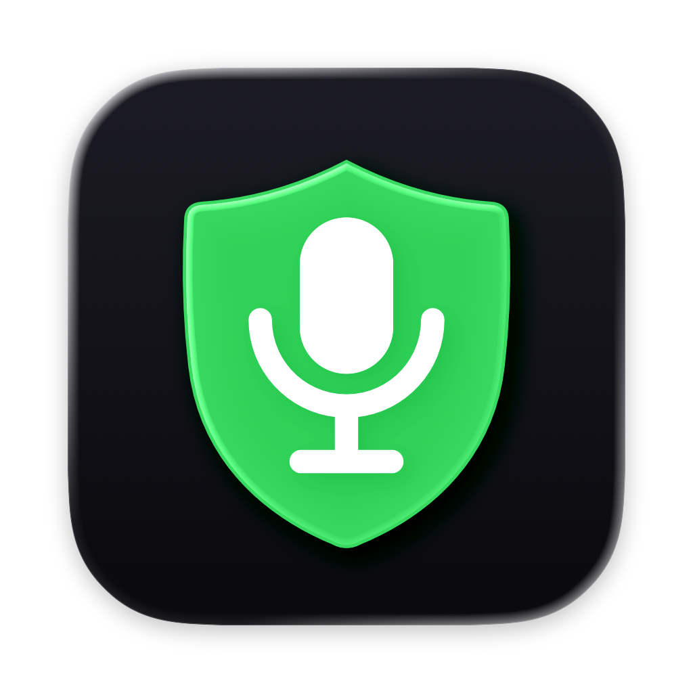
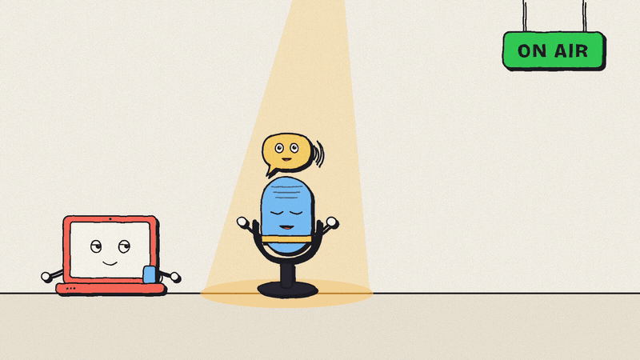

<p align="center">
  
</p>

<h1 align="center">Mic Guard</h1>

<p align="center">
  <b>Stop the mic fights.</b> Your AirPods steal the mic every time they connect. Mic Guard gives it back.<br>
  <a href="https://redesignedrobot.github.io/mic-guard/">Website</a> ·
  <a href="https://github.com/RedesignedRobot/mic-guard/releases/latest">Download</a>
</p>

<p align="center">
  
</p>

I use a wireless mic whose receiver plugs in over USB. Every time my AirPods connect, macOS moves the input to them. The AirPods mic sounds worse, and using it drops the AirPods to Bluetooth's low-quality call codec. Mic Guard is a small menu bar app that keeps the input on the best mic you have.

## How it picks

It chooses the first connected mic in this order:

1. Mics you marked **Always prefer**
2. **Wired** mics: USB, Thunderbolt, the headset jack. Wireless-mic receivers, USB podcast mics and audio interfaces all land here.
3. The **built-in** mic
4. **Bluetooth** mics, such as AirPods

Virtual devices (Zoom, Teams, loopback drivers) and mics you marked **Never use** are never chosen. If you pick a different mic in the same group yourself, Mic Guard leaves it alone. Pick one from a lower group in the menu and it pauses for an hour instead of fighting you.

## The menu

- The mic in use, and every connected mic grouped as above. Click one to switch to it.
- The last five switches, like `22:46  AirPods Pro → DJI Wireless Mic Rx`.
- Pause for 15 minutes, an hour, or until you resume.
- Settings: per-mic rules, open at login, a notification on each switch, and the mic name in the menu bar.
- With a DJI Mic Mini 2 receiver plugged in, a battery row under it shows the transmitter's charge, "charging" when docked, or "Transmitter off". The receiver only reports 7 steps, from full to almost empty, so the row shows six bars and a rounded level like "About 80%". Each step lasts about 1.5 to 2 hours, so the level holding still for a while is normal. Mic Guard reads it from the receiver's USB control channel about once a minute and never touches the audio stream. When a transmitter gets low, it sends one alert at the last bar and another just before it shuts off, if you allowed notifications in Settings.

## Install

Requires macOS 15 Sequoia or later, on Apple Silicon or Intel. Paste this into Terminal:

```sh
curl -fsSL https://redesignedrobot.github.io/mic-guard/install.sh | zsh
```

It downloads the latest release, checks its SHA-256, installs Mic Guard to Applications and opens it. There's no security prompt and you don't need Xcode. Run it again to update. The [script](docs/install.sh) is about 90 lines if you want to read it first.

Mic Guard adds itself to your login items on first launch. Turn that off in Settings if you'd rather not.

| To | Run |
|---|---|
| Build from source instead (needs `xcode-select --install`) | `curl -fsSL https://redesignedrobot.github.io/mic-guard/install.sh \| zsh -s -- --source` |
| Uninstall, including settings | `curl -fsSL https://redesignedrobot.github.io/mic-guard/install.sh \| zsh -s -- --uninstall` |

### Manual download

1. Download `MicGuard.zip` from the [latest release](https://github.com/RedesignedRobot/mic-guard/releases/latest) and unzip it.
2. Move `MicGuard.app` to Applications and open it.
3. The app isn't notarized, so macOS blocks the first launch from a browser download. Open **System Settings → Privacy & Security** and click **Open Anyway**.

### Build from a clone

With the Xcode Command Line Tools installed:

```sh
git clone https://github.com/RedesignedRobot/mic-guard
cd mic-guard
./build.sh
```

That builds a universal app, installs it to `~/Applications` and opens it. Set `SIGNING_IDENTITY` to sign with your own certificate. `./build.sh zip` writes the release zip and its checksum instead.

## How it works

Mic Guard listens for Core Audio's device-list and default-input notifications, so it does nothing until something changes. The only exception is the DJI battery check, about once a minute while a DJI receiver is plugged in. When a notification fires, it waits 300 ms for the burst to settle, ranks the inputs, and sets the default input with the Swift Core Audio API (`AudioHardwareSystem`) added in macOS 15.

It never opens an audio stream, so it can't hear anything and macOS doesn't ask for microphone permission. It makes no network requests. The whole app is about 900 lines of Swift in [`Sources/`](Sources).

Logs go to the unified log:

```sh
/usr/bin/log show --last 1h --predicate 'subsystem == "com.local.MicGuard"' --info
```

Every change in the DJI battery step is logged with its time, so you can see how long each step lasted:

```sh
/usr/bin/log show --last 1d --predicate 'subsystem == "com.local.MicGuard" AND category == "dji"'
```

## License

MIT. Built by [Amir Ayub](https://github.com/RedesignedRobot).
